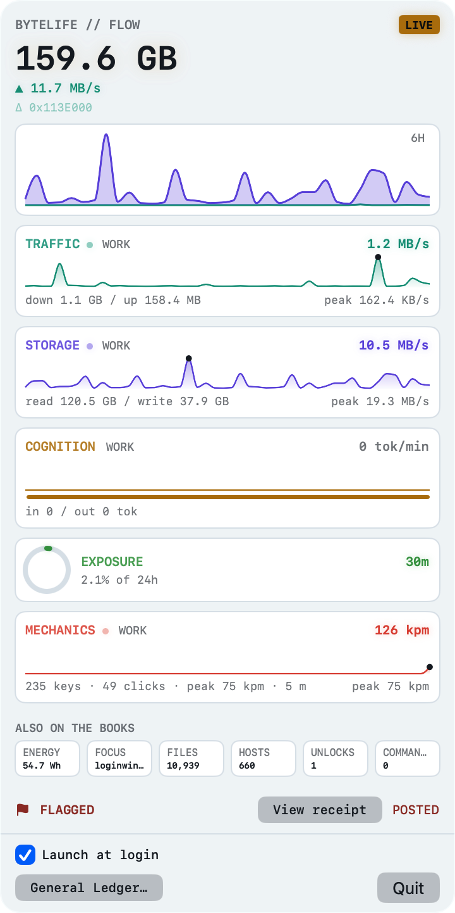
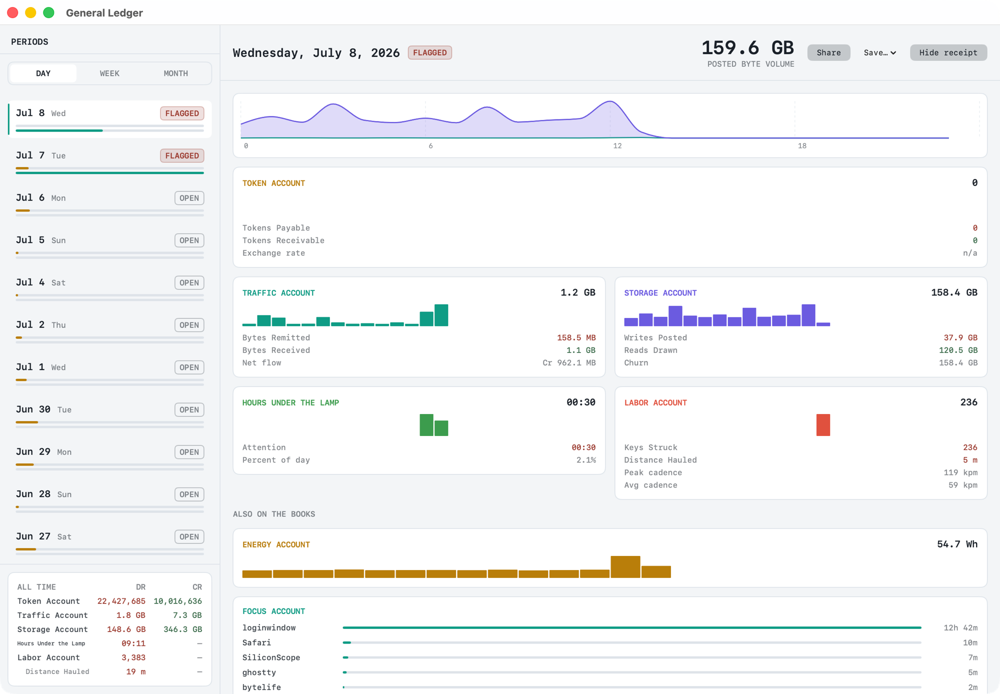

<h1 align="center">ByteLife</h1>

<p align="center">A native macOS menu bar app that tracks your digital life in bytes:<br>AI tokens, network, disk, screen time, and input, all under one roof.</p>

<p align="center">
  
</p>

ByteLife lives in your menu bar and keeps a running account of the digital side of your day. Click the icon and the **Byte Flow** deck drops down: a live, chart-led dashboard of five channels updating in real time. Behind it sits a double-entry **Ledger** that records each day, lets you close the books, and prints a shareable receipt. Everything is measured locally, and the app records counts, never contents.

## The idea

Every day you exchange an enormous amount of information with the digital world: prompts and answers, packets up and down, reads and writes, hours of attention, thousands of keystrokes. ByteLife counts all of those digital footprints and reports them in a single currency, the byte. Seeing that daily volume in one place is a quiet way to sense how much you actually traded with the digital world today. Over time it reads as a rough proxy for the day's output, a productivity indicator you interpret for yourself rather than a score the app hands down.

## Install

```sh
brew tap vigeng/tap
brew install --cask bytelife
```

That is the whole thing. The cask clears the Gatekeeper quarantine on install, so the app opens straight away. ByteLife is ad-hoc signed and not notarized (it is a personal project, not a paid Developer ID build), so if your Homebrew has `HOMEBREW_REQUIRE_TAP_TRUST` set, run `brew trust vigeng/tap` once after tapping.

Prefer to download the zip from [Releases](https://github.com/ViGeng/byteslife/releases) by hand? Remove the quarantine attribute yourself afterward:

```sh
xattr -cr /Applications/ByteLife.app
```

Requires macOS 14 (Sonoma) or newer. It runs as a menu bar item with no Dock icon.

## What it tracks

Five core families, each reported in or alongside literal byte counts:

- **Traffic** — network bytes sent and received.
- **Storage** — disk bytes written and read.
- **Cognition** — AI tokens prompted and generated, read from local Claude Code, Codex CLI, and Gemini CLI logs, broken down by model and session.
- **Exposure** — time spent in front of an awake display.
- **Mechanics** — keystrokes, clicks, scrolls, and cumulative mouse travel.

Plus a deck of auxiliary accounts kept *also on the books*: energy drawn (measured at the wall via the SMC), the app you focus on most, files touched (counts only, never paths), distinct hosts contacted (salted hashes only, never names), terminal commands run, and a sensor deck of lid opens, wakes, thermals, battery, ambient light, brightness, and audio. Every source that is absent on your machine degrades to an honest "not reporting" state rather than a broken panel.

## Two surfaces

The **panel** is the live view. It opens fully formed with warm rates, animates figures as they climb, carries a LIVE toggle, and lets each channel pick its own chart window from 30 minutes up to 24 hours (or a custom work window). The hero number is the day's posted byte volume; the channels below it each show a live rate, a sparkline, a peak mark, and the day's directional totals.

The **General Ledger** is the record. It treats your digital life as a small estate and installs you as its accountant: paired flows book as debits and credits, screen time and input book frankly as expense accounts, and each day can be *reconciled* with one click into an immutable, hash-stamped receipt you can save as a PDF or image. Browse by day, week, or month, with an all-time trial balance in the corner.



## Privacy

ByteLife is local-first and records **counts, never contents**.

- There is no network client in the app, so there is nothing to phone home with. You are welcome to confirm that with Little Snitch.
- Data lives only in `~/Library/Application Support/ByteLife/bytelife.sqlite` on your Mac.
- Keystrokes are counted and their key codes discarded; the event tap never sees what you type in password fields by OS design. Hostnames and Bluetooth peripheral names are stored only as salted, non-reversible hashes. File and command activity is counted, never read.
- The app never issues a productivity score or judgment. It reports raw numbers and leaves the meaning to you.

## Permissions

Only **Input Monitoring** ever prompts, and only when you choose to light up the Mechanics channel from the panel; ByteLife never raises the prompt on its own. Everything else either needs no permission or degrades honestly when a source is unavailable. Bluetooth counting stays dormant behind an authorization gate until a future release adds an explicit opt-in.

## Building from source

Needs macOS 14+ and a Swift 6 toolchain.

```sh
swift build           # build the package
swift test            # run the core test suite (386 tests)
./scripts/package-app.sh   # assemble an ad-hoc-signed dist/ByteLife.app
```

The architecture is a small core plus per-metric collectors: one resident menu bar process hosts in-process Swift collector modules behind a shared protocol, each with its own availability state, all writing normalized samples into a local SQLite store with minute and daily rollups. All the logic lives in `Sources/ByteLifeCore/` and is covered by tests; `Sources/ByteLifeApp/` is a thin SwiftUI shell.

`scripts/release.sh` publishes a version end to end: it builds, zips, cuts a GitHub release on this repo, and updates the cask in [vigeng/homebrew-tap](https://github.com/ViGeng/homebrew-tap).

## Design and background

The Ledger framing is not decorative. Three of the five families really are paired directional flows (traffic pairs sent against received, storage writes against reads, AI prompted against generated), so debit and credit columns are the data's native shape; the two that do not pair are booked frankly as expense accounts instead of faking a balance. The voice is a competent, faintly weary bookkeeper with dry wit and no moralizing.

- [PLAN.md](PLAN.md) — the living implementation plan, with each iteration's decisions and post-execution notes.
- [CHANGELOG.md](CHANGELOG.md) — the append-only iteration log.
- [docs/design/](docs/design/) — forward-looking design notes, including the multi-device holdings model and agentless SSH collection of remote servers.
- [docs/research/](docs/research/) — the concept exploration behind the Ledger direction: a market landscape scan, a macOS feasibility study, five concept sheets, and the judge panel that scored them.

## Status

ByteLife is at version 0.8.1 and actively developed. Traffic, storage, cognition, exposure, and mechanics all collect and render; the Ledger, reconcile ritual, receipts, and General Ledger window are in place. On the roadmap: notional AI dollar cost at list prices, a composite "how busy was today" index, git and calendar activity, and multi-device support. It has no cloud sync, accounts, goals, streaks, or telemetry, by design.

---

<sub>ByteLife is written with the help of AI (Claude).</sub>
